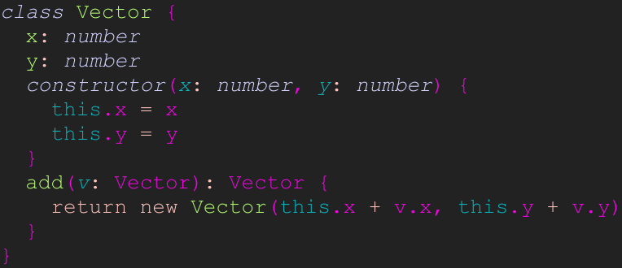

<h1>
code-syntax <a href="https://npmjs.org/package/code-syntax"></a> <a href="src"></a> <a href="https://cdn.jsdelivr.net/npm/code-syntax@3.0.0/dist/code-syntax.min.js"></a> <a href="LICENSE"></a>
</h1>

<p></p>

Code syntax highlight Web Component

<h4>
<table><tr><td title="Triple click to select and copy paste">
<code>npm i code-syntax </code>
</td><td title="Triple click to select and copy paste">
<code>pnpm add code-syntax </code>
</td><td title="Triple click to select and copy paste">
<code>yarn add code-syntax</code>
</td></tr></table>
</h4>

## Examples

<details id="example$web" title="web" open><summary><span><a href="#example$web">#</a></span>  <code><strong>web</strong></code></summary>  <ul><p></p>  <a href="https://stagas.github.io/code-syntax/example/web.html"></img>  <p><strong>Try it live</strong></p></a>    <details id="source$web" title="web source code" ><summary><span><a href="#source$web">#</a></span>  <code><strong>view source</strong></code></summary>  <a href="example/web.ts">example/web.ts</a>  <p>

```ts
import 'plenty-themes/cobalt2.css'
import 'plenty-themes/laser.css'
import 'code-syntax/themes/default.css'

import { CodeSyntaxElement, languages } from 'code-syntax'
import js from 'code-syntax/languages/js'

customElements.define('code-syntax', CodeSyntaxElement)

languages.js = js // can also be import(code-syntax.) directly

document.body.innerHTML = `
<code-syntax id="demo" style="display:inline-flex;" language="js" theme="laser">class Vector {
  x: number
  y: number
  constructor(x: number, y: number) {
    this.x = x
    this.y = y
  }
  add(v: Vector): Vector {
    return new Vector(this.x + v.x, this.y + v.y)
  }
}
</code-syntax>
`
```

</p>
</details></ul></details>

## API

<p>  <details id="CodeSyntaxElement$12" title="Class" ><summary><span><a href="#CodeSyntaxElement$12">#</a></span>  <code><strong>CodeSyntaxElement</strong></code>    </summary>  <a href="src/element.ts#L45">src/element.ts#L45</a>  <ul>        <p>  <details id="constructor$13" title="Constructor" ><summary><span><a href="#constructor$13">#</a></span>  <code><strong>constructor</strong></code><em>()</em>    </summary>    <ul>    <p>  <details id="new CodeSyntaxElement$14" title="ConstructorSignature" ><summary><span><a href="#new CodeSyntaxElement$14">#</a></span>  <code><strong>new CodeSyntaxElement</strong></code><em>()</em>    </summary>    <ul><p><a href="#CodeSyntaxElement$12">CodeSyntaxElement</a></p>        </ul></details></p>    </ul></details><details id="codeHTML$20" title="Property" ><summary><span><a href="#codeHTML$20">#</a></span>  <code><strong>codeHTML</strong></code>    </summary>  <a href="src/element.ts#L53">src/element.ts#L53</a>  <ul><p>string</p>        </ul></details><details id="codeRawText$21" title="Property" ><summary><span><a href="#codeRawText$21">#</a></span>  <code><strong>codeRawText</strong></code>    </summary>  <a href="src/element.ts#L54">src/element.ts#L54</a>  <ul><p>string</p>        </ul></details><details id="codeRef$19" title="Property" ><summary><span><a href="#codeRef$19">#</a></span>  <code><strong>codeRef</strong></code>    </summary>  <a href="src/element.ts#L52">src/element.ts#L52</a>  <ul><p><span>HTMLElement</span></p>        </ul></details><details id="highlight$22" title="Property" ><summary><span><a href="#highlight$22">#</a></span>  <code><strong>highlight</strong></code>    </summary>  <a href="src/element.ts#L55">src/element.ts#L55</a>  <ul><p><details id="__type$23" title="Function" ><summary><span><a href="#__type$23">#</a></span>  <em>(s)</em>    </summary>    <ul>    <p>    <details id="s$25" title="Parameter" ><summary><span><a href="#s$25">#</a></span>  <code><strong>s</strong></code>    </summary>    <ul><p>string</p>        </ul></details>  <p><strong></strong><em>(s)</em>  &nbsp;=&gt;  <ul>string</ul></p></p>    </ul></details></p>        </ul></details><details id="language$16" title="Property" ><summary><span><a href="#language$16">#</a></span>  <code><strong>language</strong></code>  <span><span>&nbsp;=&nbsp;</span>  <code>$.String</code></span>  </summary>  <a href="src/element.ts#L48">src/element.ts#L48</a>  <ul><p>undefined | string</p>        </ul></details><details id="onTextContent$26" title="Property" ><summary><span><a href="#onTextContent$26">#</a></span>  <code><strong>onTextContent</strong></code>    </summary>  <a href="src/element.ts#L56">src/element.ts#L56</a>  <ul><p><details id="__type$27" title="Function" ><summary><span><a href="#__type$27">#</a></span>  <em>(textContent)</em>    </summary>    <ul>    <p>    <details id="textContent$29" title="Parameter" ><summary><span><a href="#textContent$29">#</a></span>  <code><strong>textContent</strong></code>    </summary>    <ul><p>string</p>        </ul></details>  <p><strong></strong><em>(textContent)</em>  &nbsp;=&gt;  <ul>void</ul></p></p>    </ul></details></p>        </ul></details><details id="onmounted$42" title="Property" ><summary><span><a href="#onmounted$42">#</a></span>  <code><strong>onmounted</strong></code>    </summary>    <ul><p><span>EventHandler</span>&lt;<a href="#CodeSyntaxElement$12">CodeSyntaxElement</a>, <span>CustomEvent</span>&lt;any&gt;&gt;</p>        </ul></details><details id="onunmounted$43" title="Property" ><summary><span><a href="#onunmounted$43">#</a></span>  <code><strong>onunmounted</strong></code>    </summary>    <ul><p><span>EventHandler</span>&lt;<a href="#CodeSyntaxElement$12">CodeSyntaxElement</a>, <span>CustomEvent</span>&lt;any&gt;&gt;</p>        </ul></details><details id="root$15" title="Property" ><summary><span><a href="#root$15">#</a></span>  <code><strong>root</strong></code>  <span><span>&nbsp;=&nbsp;</span>  <code>...</code></span>  </summary>  <a href="src/element.ts#L46">src/element.ts#L46</a>  <ul><p><span>ShadowRoot</span></p>        </ul></details><details id="syntax$18" title="Property" ><summary><span><a href="#syntax$18">#</a></span>  <code><strong>syntax</strong></code>    </summary>  <a href="src/element.ts#L51">src/element.ts#L51</a>  <ul><p><a href="#SyntaxOrImport$8">SyntaxOrImport</a></p>        </ul></details><details id="theme$17" title="Property" ><summary><span><a href="#theme$17">#</a></span>  <code><strong>theme</strong></code>  <span><span>&nbsp;=&nbsp;</span>  <code>$.String</code></span>  </summary>  <a href="src/element.ts#L49">src/element.ts#L49</a>  <ul><p>undefined | string</p>        </ul></details><details id="mounted$30" title="Method" ><summary><span><a href="#mounted$30">#</a></span>  <code><strong>mounted</strong></code><em>($)</em>    </summary>  <a href="src/element.ts#L58">src/element.ts#L58</a>  <ul>    <p>    <details id="$$32" title="Parameter" ><summary><span><a href="#$$32">#</a></span>  <code><strong>$</strong></code>    </summary>    <ul><p><span>Context</span>&lt;<a href="#CodeSyntaxElement$12">CodeSyntaxElement</a> &amp; <span>JsxContext</span>&lt;<a href="#CodeSyntaxElement$12">CodeSyntaxElement</a>&gt; &amp; <span>Omit</span>&lt;{<p>    <details id="ctor$36" title="Parameter" ><summary><span><a href="#ctor$36">#</a></span>  <code><strong>ctor</strong></code>    </summary>    <ul><p><span>Class</span>&lt;<a href="#T$35">T</a>&gt;</p>        </ul></details>  <p><strong></strong>&lt;<span>T</span>&gt;<em>(ctor)</em>  &nbsp;=&gt;  <ul><span>CleanClass</span>&lt;<a href="#T$35">T</a>&gt;</ul></p>  <details id="ctx$40" title="Parameter" ><summary><span><a href="#ctx$40">#</a></span>  <code><strong>ctx</strong></code>    </summary>    <ul><p><a href="#T$39">T</a> | <span>Class</span>&lt;<a href="#T$39">T</a>&gt;</p>        </ul></details>  <p><strong></strong>&lt;<span>T</span>&gt;<em>(ctx)</em>  &nbsp;=&gt;  <ul><span>Wrapper</span>&lt;<a href="#T$39">T</a>&gt;</ul></p></p>} &amp; <span>__module</span> &amp; {}, <code>"transition"</code>&gt;&gt;</p>        </ul></details>  <p><strong>mounted</strong><em>($)</em>  &nbsp;=&gt;  <ul>void</ul></p></p>    </ul></details></p></ul></details><details id="PatchOptions$53" title="Interface" ><summary><span><a href="#PatchOptions$53">#</a></span>  <code><strong>PatchOptions</strong></code>    </summary>  <a href="src/util.ts#L3">src/util.ts#L3</a>  <ul>        <p>  <details id="theme$54" title="Property" ><summary><span><a href="#theme$54">#</a></span>  <code><strong>theme</strong></code>    </summary>  <a href="src/util.ts#L4">src/util.ts#L4</a>  <ul><p>string</p>        </ul></details><details id="getLanguage$55" title="Method" ><summary><span><a href="#getLanguage$55">#</a></span>  <code><strong>getLanguage</strong></code><em>(el)</em>    </summary>  <a href="src/util.ts#L5">src/util.ts#L5</a>  <ul>    <p>    <details id="el$57" title="Parameter" ><summary><span><a href="#el$57">#</a></span>  <code><strong>el</strong></code>    </summary>    <ul><p><span>Element</span></p>        </ul></details>  <p><strong>getLanguage</strong><em>(el)</em>  &nbsp;=&gt;  <ul>string</ul></p></p>    </ul></details></p></ul></details><details id="SyntaxDefinition$5" title="Interface" ><summary><span><a href="#SyntaxDefinition$5">#</a></span>  <code><strong>SyntaxDefinition</strong></code>    </summary>  <a href="src/syntax.ts#L6">src/syntax.ts#L6</a>  <ul>        </ul></details><details id="RegExpMap$44" title="TypeAlias" ><summary><span><a href="#RegExpMap$44">#</a></span>  <code><strong>RegExpMap</strong></code>    </summary>  <a href="src/syntax.ts#L3">src/syntax.ts#L3</a>  <ul><p><span>Record</span>&lt;string, <a href="#RegExpMapped$1">RegExpMapped</a>&gt;</p>        </ul></details><details id="RegExpMapped$1" title="TypeAlias" ><summary><span><a href="#RegExpMapped$1">#</a></span>  <code><strong>RegExpMapped</strong></code>    </summary>  <a href="src/syntax.ts#L4">src/syntax.ts#L4</a>  <ul><p><span>RegExp</span> &amp; {<p>  <details id="keys$4" title="Property" ><summary><span><a href="#keys$4">#</a></span>  <code><strong>keys</strong></code>    </summary>  <a href="src/syntax.ts#L4">src/syntax.ts#L4</a>  <ul><p><span>Set</span>&lt;string&gt;</p>        </ul></details><details id="map$3" title="Property" ><summary><span><a href="#map$3">#</a></span>  <code><strong>map</strong></code>    </summary>  <a href="src/syntax.ts#L4">src/syntax.ts#L4</a>  <ul><p><a href="#RegExpMap$44">RegExpMap</a></p>        </ul></details></p>}</p>        </ul></details><details id="SyntaxOrImport$8" title="TypeAlias" ><summary><span><a href="#SyntaxOrImport$8">#</a></span>  <code><strong>SyntaxOrImport</strong></code>    </summary>  <a href="src/syntax.ts#L10">src/syntax.ts#L10</a>  <ul><p><a href="#SyntaxDefinition$5">SyntaxDefinition</a> | <span>Promise</span>&lt;{<p>  <details id="default$10" title="Property" ><summary><span><a href="#default$10">#</a></span>  <code><strong>default</strong></code>    </summary>  <a href="src/syntax.ts#L10">src/syntax.ts#L10</a>  <ul><p><a href="#SyntaxDefinition$5">SyntaxDefinition</a></p>        </ul></details></p>}&gt;</p>        </ul></details><details id="languages$11" title="Variable" ><summary><span><a href="#languages$11">#</a></span>  <code><strong>languages</strong></code>  <span><span>&nbsp;=&nbsp;</span>  <code>{}</code></span>  </summary>  <a href="src/element.ts#L8">src/element.ts#L8</a>  <ul><p><span>Record</span>&lt;string, <a href="#SyntaxOrImport$8">SyntaxOrImport</a>&gt;</p>        </ul></details><details id="compile$45" title="Function" ><summary><span><a href="#compile$45">#</a></span>  <code><strong>compile</strong></code><em>(def, keys)</em>     &ndash; Compiles a syntax definition.</summary>  <a href="src/syntax.ts#L24">src/syntax.ts#L24</a>  <ul>    <p>  <p>

```js
const r = await compile({
  foo: /[a-z]/,
  bar: /[0-9]/,
})
```

</p>
  <details id="def$47" title="Parameter" ><summary><span><a href="#def$47">#</a></span>  <code><strong>def</strong></code>     &ndash; The syntax definition to compile. Can be a promise returned by <code>import()</code>.
</summary>    <ul><p><a href="#SyntaxOrImport$8">SyntaxOrImport</a></p>        </ul></details><details id="keys$48" title="Parameter" ><summary><span><a href="#keys$48">#</a></span>  <code><strong>keys</strong></code>  <span><span>&nbsp;=&nbsp;</span>  <code>...</code></span>  </summary>    <ul><p><span>Set</span>&lt;string&gt;</p>        </ul></details>  <p><strong>compile</strong><em>(def, keys)</em>  &nbsp;=&gt;  <ul><span>Promise</span>&lt;<a href="#RegExpMapped$1">RegExpMapped</a>&gt;</ul></p></p>    </ul></details><details id="patchElements$58" title="Function" ><summary><span><a href="#patchElements$58">#</a></span>  <code><strong>patchElements</strong></code><em>(elements, <span>Partial</span>&lt;<a href="#PatchOptions$53">PatchOptions</a>&gt;)</em>    </summary>  <a href="src/util.ts#L8">src/util.ts#L8</a>  <ul>    <p>    <details id="elements$60" title="Parameter" ><summary><span><a href="#elements$60">#</a></span>  <code><strong>elements</strong></code>    </summary>    <ul><p><span>Element</span>  []</p>        </ul></details><span>Partial</span>&lt;<a href="#PatchOptions$53">PatchOptions</a>&gt;  <p><strong>patchElements</strong><em>(elements, <span>Partial</span>&lt;<a href="#PatchOptions$53">PatchOptions</a>&gt;)</em>  &nbsp;=&gt;  <ul>void</ul></p></p>    </ul></details><details id="patchPreCodeElements$62" title="Function" ><summary><span><a href="#patchPreCodeElements$62">#</a></span>  <code><strong>patchPreCodeElements</strong></code><em>(opts)</em>    </summary>  <a href="src/util.ts#L27">src/util.ts#L27</a>  <ul>    <p>    <details id="opts$64" title="Parameter" ><summary><span><a href="#opts$64">#</a></span>  <code><strong>opts</strong></code>    </summary>    <ul><p><span>Partial</span>&lt;<a href="#PatchOptions$53">PatchOptions</a>&gt;</p>        </ul></details>  <p><strong>patchPreCodeElements</strong><em>(opts)</em>  &nbsp;=&gt;  <ul>void</ul></p></p>    </ul></details><details id="syntax$49" title="Function" ><summary><span><a href="#syntax$49">#</a></span>  <code><strong>syntax</strong></code><em>(regexp, s)</em>     &ndash; Syntax highlights a string as html with the given syntax.</summary>  <a href="src/syntax.ts#L68">src/syntax.ts#L68</a>  <ul>    <p>  <p>

```js
const regexp = await compile({
  foo: /[a-z]+/,
  bar: [
    /[0-9]+/,
    {
      bar: /[0-5]+/,
    },
  ],
})
const html = syntax(regexp, 'hello 123 789 world')
```

</p>
  <details id="regexp$51" title="Parameter" ><summary><span><a href="#regexp$51">#</a></span>  <code><strong>regexp</strong></code>     &ndash; The syntax definition returned by <code>compile()</code></summary>    <ul><p><span>RegExp</span> | <a href="#RegExpMapped$1">RegExpMapped</a></p>        </ul></details><details id="s$52" title="Parameter" ><summary><span><a href="#s$52">#</a></span>  <code><strong>s</strong></code>     &ndash; The string to highlight.
</summary>    <ul><p>string</p>        </ul></details>  <p><strong>syntax</strong><em>(regexp, s)</em>  &nbsp;=&gt;  <ul>string</ul></p></p>    </ul></details></p>

## Credits

- [html-escaper](https://npmjs.org/package/html-escaper) by [Andrea Giammarchi](https://github.com/WebReflection) &ndash; fast and safe way to escape and unescape &<>'" chars
- [sigl](https://npmjs.org/package/sigl) by [stagas](https://github.com/stagas) &ndash; Web framework

## Contributing

[Fork](https://github.com/stagas/code-syntax/fork) or [edit](https://github.dev/stagas/code-syntax) and submit a PR.

All contributions are welcome!

## License

<a href="LICENSE">MIT</a> &copy; 2022 [stagas](https://github.com/stagas)
